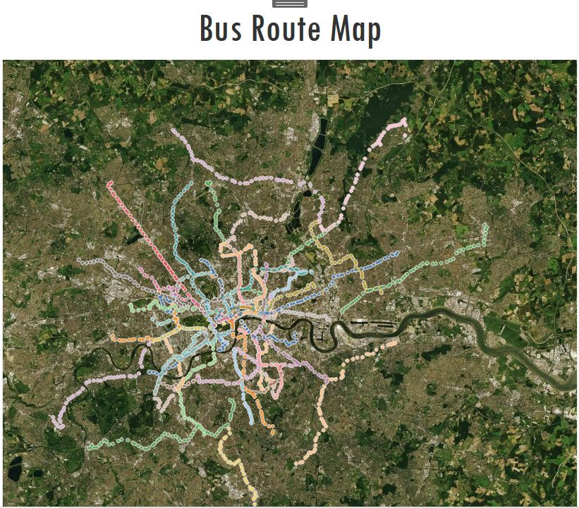

## Project Overview

The Williamsburg-James City County (WJCC) school district serves the greater area of Williamsburg and is committed to ensuring every student has the means to attend school and receive an education. In order to achieve this, a great deal of time and effort is placed into carefully determining guidelines for successfully transporting students to and from their respective schools. 

This project aims to examine the current criteria for creating bus routes and seeks to propose new, more efficient routes, supported by model justification and analysis, via optimizing the assignment of stops to routes. 

## Current Guidelines

- Students must arrive to school in the morning at least 10 minutes prior to the starting bell
- Buses must account for 10 minutes in the afternoon while loading students from school
- Each bus within a route can only serve one school at a time
- High school and middle school buses have a capacity estimate of 54 students
- Elementary school buses have a capacity estimate of 77 students
- Routes must be completed in order of tier, starting with tier one and ending with tier three

## Results

### Routes Visualizaion

 
[Click here to view my Tableau dashboard online](https://public.tableau.com/views/WJCCBusRouteMap/Dashboard1?:language=zh-Hans&:display_count=y&publish=yes&:origin=viz_share_link)

### Bus Capacities
There was a significant disparity between the capacity of the buses compared to how many students WJCC planned to pick up along a given route. This was particularly applicable to the middle and high schools. Those capacities are capped at 52 because older, growing children occupy more space than the younger elementary students. After filtering out some of the outliers, the average overbooked bus capacity was roughly 67 students. Increasing the bus capacity to 65 allowed the model to mirror WJCC’s expectation that not every student at a stop is going to actually ride the bus.

### Consistent AM Route Beginning Time
There was a significant disparity between the capacity of the buses compared to how many students WJCC planned to pick up along a given route. This was particularly applicable to the middle and high schools. Those capacities are capped at 52 because older, growing children occupy more space than the younger elementary students. After filtering out some of the outliers, the average overbooked bus capacity was roughly 67 students. Increasing the bus capacity to 65 allowed the model to mirror WJCC’s expectation that not every student at a stop is going to actually ride the bus.

### Toano Middle School as Tier 2
 A key takeaway was the possibility of designating Toano Middle School as a Tier 2 school, instead of being a Tier 1 school. When Toano was designated as a Tier 1 school, it functioned as a bottleneck and created more time between the start of subsequent routes. Additionally, Toano functioned best when another school was re-designated, such as when James River Elementary School was designated as a Tier 3 school. If Toano was left to function alone as a Tier 2 school without any other changes to the current list of school tiers, Toano would continue to act as a bottleneck but in a different tier. Therefore, another school must be designated to another tier in addition with Toano as Tier 2 to balance travel times between buses. 
Although Toano satisfied required constraints, the newly created schedule of routes required more buses, with larger numbers in the afternoon than the morning. The following table below indicates the required number of buses from both the initial data and model results, as well as factoring in the new schedule with Toano as Tier 2 and James River as Tier 3.

## Solution Explanation

When deciding upon a software to aid in the creation of a model, the following tools were investigated using Python programming language: Gurobi Optimizer, Google OR-Tools and heuristic methods. Gurobi was explored as an optimization tool for the current routes, but its use proved inconclusive as troubleshooting became difficult to work past. Model success was derived from the implementation of both Google OR-Tools and by applying heuristic algorithms. Google OR-Tools is open-source (freely available) and offers model equations to obtain solutions to optimization problems. Heuristics was used to minimize the distance between stops to acquire a greedy solution.

The model reschedules stops and routes for each school using Google OR-Tools. Google OR-Tools allowed the capability of using multiple solution strategies for vehicle routing problems. The strategy incorporated within the model is the “PATH-CHEAPEST” strategy, which involves a top-down, greedy search method that starts from a route "start" node, and connects it to the node which produces the cheapest route. In addition, it also allows further considerations towards capacity constraints of buses based on the number of students in each stop. The routes of each school are optimized school-by-school, tier-by-tier, and keeps track of the buses. For modeling purposes, every available bus in each school was sent out, although some were not actually sent out to perform a run. After assigning each school, the available buses were updated at each depot or school. After completing a tier, the quantity of buses available was then reset for the following tier.

